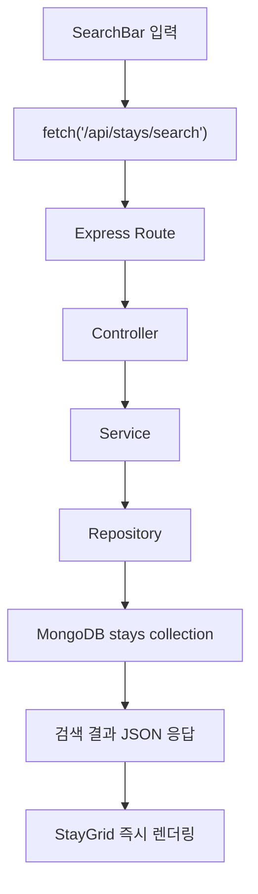
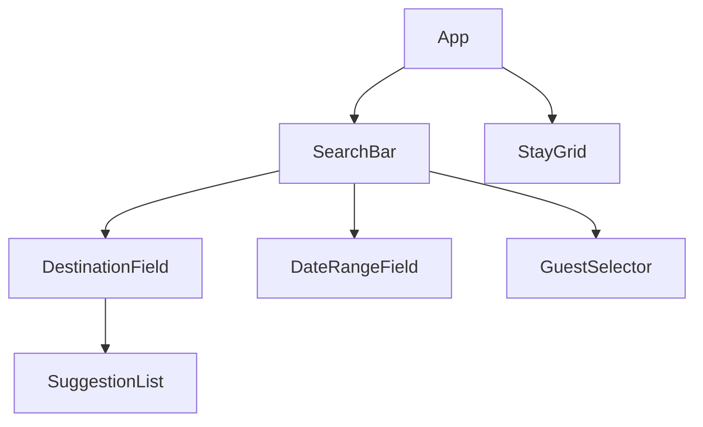

# 관악bnb 검색 설계 문서

## 목표

- 프론트에서 `fetch` API로 원격 Express 서버에 검색 요청을 보낸다.
- MongoDB에 저장된 숙소 데이터를 조건에 맞게 조회한다.
- 검색 결과를 페이지 이동 없이 같은 화면 하단에 렌더링한다.
- `여행지`, `여행 인원`을 1차 필수 검색 조건으로 사용한다.
- `체크인`, `체크아웃`은 선택 조건으로 함께 보낼 수 있다.

## 화면 흐름



## 컴포넌트 구조



## 프론트 상태 설계

| 상태 | 타입 | 설명 |
| --- | --- | --- |
| `searchForm.destination` | `string` | 현재 입력 중인 여행지 |
| `searchForm.checkIn` | `string` | 체크인 날짜 |
| `searchForm.checkOut` | `string` | 체크아웃 날짜 |
| `guests` | `object` | 성인, 어린이, 유아, 반려동물 수 |
| `activePanel` | `"destination" \| "guests" \| null` | 열린 레이어 상태 |
| `stays` | `array` | 백엔드 검색 결과 |
| `searchMeta` | `object \| null` | 마지막 검색 조건과 결과 개수 |
| `hasSearched` | `boolean` | 검색 전/후 화면 분기 |
| `isSearching` | `boolean` | 요청 진행 상태 |
| `formErrorMessage` | `string` | 클라이언트 입력 검증 메시지 |
| `searchErrorMessage` | `string` | 서버 응답 오류 메시지 |

## 백엔드 구조

```text
server
├─ app.js
├─ index.js
├─ config
│  ├─ database.js
│  └─ env.js
├─ controllers
│  └─ stayController.js
├─ middleware
│  └─ errorHandler.js
├─ models
│  └─ Stay.js
├─ repositories
│  └─ stayRepository.js
├─ routes
│  └─ stayRoutes.js
├─ scripts
│  └─ seedStays.js
├─ seeds
│  └─ stays.js
└─ services
   └─ stayService.js
```

### 선택한 구조

- Layered Architecture
- 라우팅, 입력 검증, 비즈니스 규칙, DB 접근을 분리해 역할을 나눴다.
- 검색 조건이 늘어나도 `service`와 `repository`를 중심으로 확장할 수 있다.

## 데이터 모델

| 필드 | 타입 | 설명 |
| --- | --- | --- |
| `slug` | `string` | 숙소 식별자 |
| `title` | `string` | 숙소 제목 |
| `summary` | `string` | 카드 설명 |
| `location` | `string` | 노출용 위치 |
| `city` | `string` | 도시 검색용 |
| `district` | `string` | 지역 검색용 |
| `category` | `string` | 카테고리 검색용 |
| `keywords` | `string[]` | 텍스트 검색용 키워드 |
| `maxGuests` | `number` | 최대 인원 |
| `petFriendly` | `boolean` | 반려동물 가능 여부 |
| `pricePerNight` | `number` | 1박 가격 |
| `rating` | `number` | 평점 |
| `reviewCount` | `number` | 리뷰 수 |
| `availability.startDate` | `Date` | 예약 가능 시작일 |
| `availability.endDate` | `Date` | 예약 가능 종료일 |

MongoDB에서는 `stays` collection이 시딩 시점에 생성된다.

## 검색 규칙

1. `destination`이 비어 있으면 요청을 거절한다.
2. `guests`가 1보다 작으면 요청을 거절한다.
3. 날짜는 둘 다 있어야만 검색 조건에 포함한다.
4. 검색어는 `title`, `location`, `city`, `district`, `category`, `keywords`를 기준으로 찾는다.
5. `maxGuests >= guests` 조건을 만족하는 숙소만 반환한다.
6. 반려동물이 포함되면 `petFriendly=true` 숙소만 반환한다.
7. 날짜가 포함되면 예약 가능 기간 안에 들어오는 숙소만 반환한다.

## API 명세

### `GET /api/stays/search`

#### Query

| 이름 | 필수 | 예시 |
| --- | --- | --- |
| `destination` | 예 | `서울` |
| `guests` | 예 | `2` |
| `pets` | 아니오 | `1` |
| `checkIn` | 아니오 | `2026-05-10` |
| `checkOut` | 아니오 | `2026-05-12` |

#### Response

```json
{
  "meta": {
    "destination": "서울",
    "guests": 2,
    "pets": 0,
    "checkIn": null,
    "checkOut": null,
    "total": 2
  },
  "stays": [
    {
      "id": "661f...",
      "title": "북촌 감성 한옥 스테이",
      "summary": "마당과 다도를 즐길 수 있는 조용한 도심 한옥",
      "location": "서울, 종로구",
      "distance": "경복궁까지 도보 11분",
      "stayInfo": "최대 4명 · 침실 2개 · 침대 2개 · 욕실 1개",
      "dates": "예약 가능 4월 20일 - 6월 30일",
      "price": "₩128,000 /박",
      "rating": 4.93,
      "badge": "게스트 선호",
      "gradient": "linear-gradient(...)"
    }
  ]
}
```

## DB 준비 방식

1. Mongoose 스키마로 `Stay` 모델을 정의한다.
2. `npm run seed` 실행 시 collection과 index를 생성한다.
3. 기존 데이터를 비우고 더미 숙소 데이터를 다시 넣는다.

## Render 배포 준비

- [render.yaml](/Users/donghyun/Documents/gwanak-bnb/render.yaml) 추가
- `npm run build` 후 `npm run start`로 서비스 실행
- `MONGO_URI`, `CLIENT_ORIGIN`, `NODE_ENV` 환경변수 사용
- Render에서는 `Web Service` 타입으로 배포한다.
- 하나의 Node 서비스가 API와 정적 프론트 번들을 함께 서빙한다.

## 검증

- `npm run seed`로 Atlas에 더미 숙소 데이터를 적재했다.
- `npm run build`로 프론트 프로덕션 번들 생성을 확인했다.
- `GET /api/health` 응답으로 서버 기동을 확인했다.
- `GET /api/stays/search?destination=서울&guests=2` 응답으로 검색 API 동작을 확인했다.

## 제출 포인트

- 프론트에서 `fetch`로 서버와 통신한다.
- 검색 결과는 새로고침 없이 즉시 렌더링된다.
- MongoDB 스키마와 더미 데이터 시딩이 포함되어 있다.
- Express 백엔드는 Layered Architecture로 구성되어 있다.
