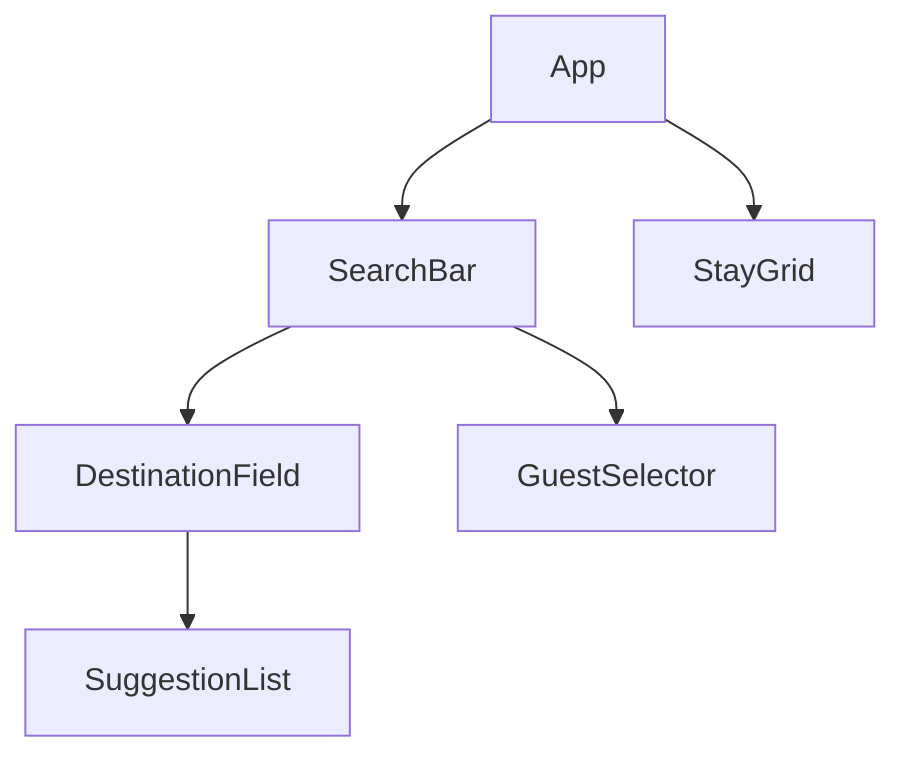

# 여행지 검색 설계 문서

## 목표

- `여행지` 입력 즉시 추천 여행 검색어를 노출한다.
- 키보드 `ArrowUp`, `ArrowDown` 으로 추천 검색어를 순환 탐색한다.
- 선택 중인 검색어를 입력창과 숙소 목록에 바로 반영한다.
- 기존 `여행자` 선택 기능과 충돌하지 않도록 검색 바 상태를 분리한다.

## 컴포넌트 구조



## 상태 설계

### 1. App이 관리하는 상태

| 상태 | 타입 | 이유 |
| --- | --- | --- |
| `destination` | `string` | 현재 검색 조건과 숙소 필터링에 공통으로 사용 |
| `activePanel` | `"destination" \| "guests" \| null` | 검색 바에서 어떤 레이어를 열지 한 곳에서 제어 |
| `guests` | `object` | 여행자 선택 결과를 요약 카드와 검색 바에서 재사용 |
| `stays`, `isLoading`, `errorMessage` | `array`, `boolean`, `string` | 서버 데이터 로딩 상태 관리 |

### 2. DestinationField가 관리하는 상태

| 상태 | 타입 | 이유 |
| --- | --- | --- |
| `typedValue` | `string` | 사용자가 마지막으로 직접 입력한 검색어 보존 |
| `activeIndex` | `number` | 키보드 이동 중 현재 강조된 추천 검색어 추적 |

`typedValue`와 `destination`을 분리한 이유는, 화살표 이동 시 입력창 값은 추천 검색어로 바뀌어도 추천 목록 필터 기준은 마지막 직접 입력값을 유지해야 하기 때문이다.

## 훅 사용 이유

- `useState`
  - 검색어, 열린 패널, 여행자 수처럼 UI에 직접 반영되는 값을 저장한다.
- `useEffect`
  - 첫 렌더 이후 숙소 데이터를 불러온다.
  - 여행지 레이어가 열릴 때 입력창에 포커스를 옮기고, 바깥 클릭/`Escape` 시 레이어를 닫는다.
- `useRef`
  - 검색 바 바깥 클릭 감지용 루트 DOM 참조에 사용한다.
  - 자동완성 입력창 포커스와 활성 옵션 스크롤 이동에 사용한다.

## 동작 흐름

1. 사용자가 `여행지` 필드를 클릭하면 `activePanel`이 `"destination"`으로 바뀐다.
2. `DestinationField`는 추천 여행지를 레이어로 보여준다.
3. 사용자가 입력하면 `typedValue`와 `destination`이 함께 갱신되고, 추천 목록이 즉시 필터링된다.
4. `ArrowDown` / `ArrowUp` 입력 시 `activeIndex`가 순환 이동한다.
5. 이동한 추천 검색어는 입력창에 즉시 반영되고, `StayGrid`도 같은 검색어로 다시 필터링된다.
6. `Enter` 또는 마우스 클릭으로 선택하면 추천 레이어를 닫는다.

## 파일 구조

```text
src
├─ components
│  ├─ SearchBar.jsx
│  ├─ GuestSelector.jsx
│  ├─ StayGrid.jsx
│  └─ search
│     ├─ DestinationField.jsx
│     ├─ DestinationField.module.css
│     ├─ SuggestionList.jsx
│     └─ SuggestionList.module.css
├─ data
│  └─ destinationSuggestions.js
└─ App.jsx
```

## 스타일 원칙

- 검색 바 공통 레이아웃은 `SearchBar.module.css`에서 유지한다.
- 여행지 자동완성 레이어와 옵션 스타일은 `search/` 하위 CSS Module로 분리한다.
- 중복 스타일을 줄이기 위해 검색 바 공통 영역과 자동완성 전용 영역을 분리했다.

## 선택하지 않은 것

- 캘린더는 이번 요구사항 핵심이 아니므로 정적 영역으로 유지한다.
- 전역 상태 라이브러리는 아직 필요하지 않아 `useState` 중심으로 설계했다.
